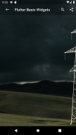

# Basic Widgets Examples

Here you will find a quick way to customise the basic flutter widgets to your taste. 

## Run this project

**EDIT** : No need of running the project, simply run the code in the new official Flutter online compiler [DartPad](https://dartpad.dartlang.org/flutter).

### Still want to run the project?
- Fork this project.
- Rename the directory to "my_basic_widgets" or something with all_lowercase_and_underscore. (Unfortunately, Flutter does not like capital letters.)
- In your terminal, run flutter create . This will create the android and iOS projects for you.
- Run in your emulator or device.

### This project helped you? Buy me a coffee to support me! [PayPal](https://paypal.me/drogbut "PayPal")

# App Background

## Stack
A widget that positions its children relative to its box.
This widget is useful if you want to overlay children in a simple way, for example overlapping the appBar, the Drawer and the body on a background image.
### Try out Stack widget and it's properties directly from [DartPad](https://dartpad.dev/d548285fd710d4c94cb1ff59835b85bd?null_safety=true) 

| Stack with Image and gradient        |            | 
| ------------- |:-------------:|
| @override    Widget build(BuildContext context) {   return Stack(  children: [ new MyBackgroundImage(imagePath: "assets/images/image1.jpg",)   Scaffold(  backgroundColor: Colors.transparent, appBar: new MyAppBar(widget.title, 20.0, color: Colors.transparent,), body:  Container(), ), ], ); }    |  | 

| Stack with Image and gradient        |            | 
| ------------- |:-------------:|
| <html>
      <code>
       @override
  Widget build(BuildContext context) {
    return Stack(
      children: [
        new MyBackgroundImage(imagePath: "assets/images/image1.jpg",),
        Scaffold(
          backgroundColor: Colors.transparent,
          appBar: new MyAppBar(widget.title, 20.0, color: Colors.transparent,),
          body:  Container(),         
        ),
      ],
    );

      </code>
    </html> |  | 
 

# AppBar

