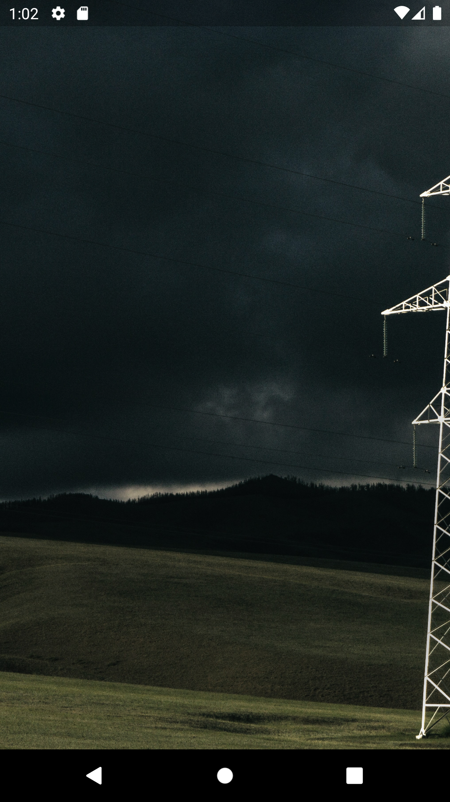
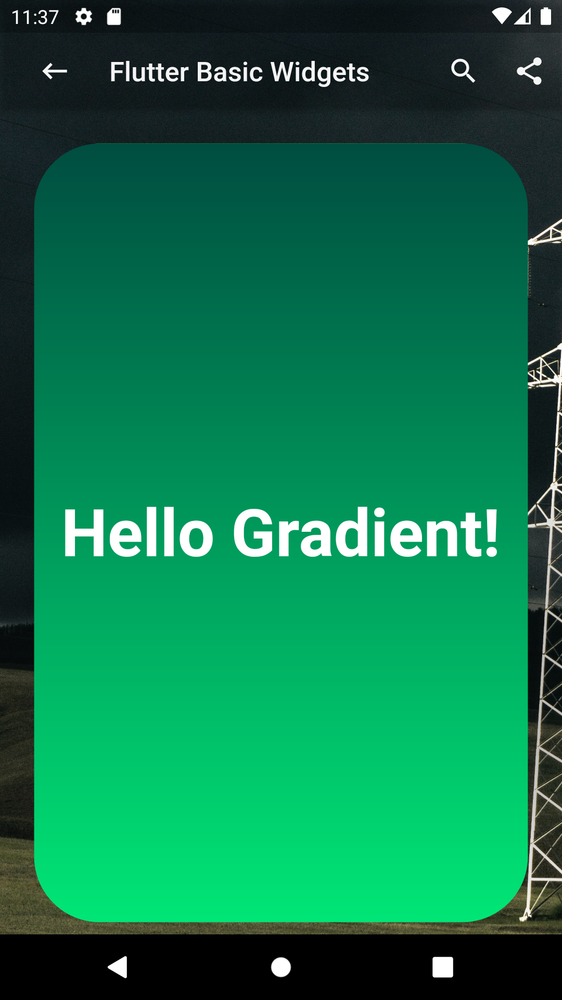
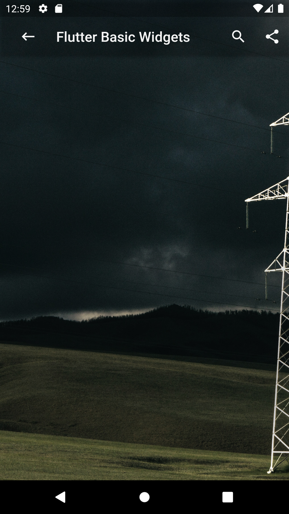
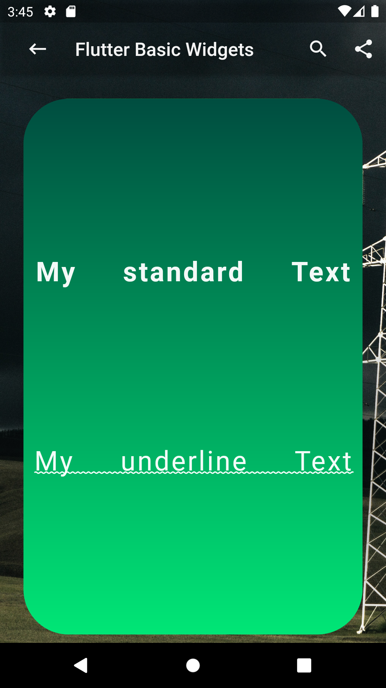
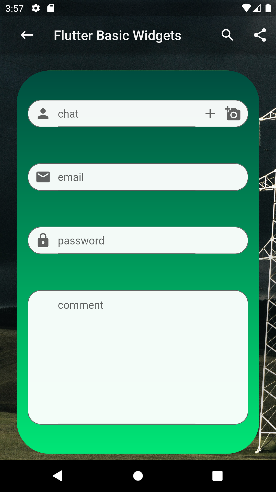

# Basic Widgets Examples

Here you will find a quick way to customise the basic flutter widgets to your taste. 

## Run this project

**EDIT** : No need of running the project, simply run the code in the new official Flutter online compiler [DartPad](https://dartpad.dartlang.org/flutter).

### Still want to run the project?
- Fork this project.
- Rename the directory to "my_basic_widgets" or something with all_lowercase_and_underscore. (Unfortunately, Flutter does not like capital letters.)
- In your terminal, run flutter create . This will create the android and iOS projects for you.
- Run in your emulator or device.

# A. App Background

## 1. Stack 
If you want to overlay children relatively to a parent, use the Stack widget. In this example, Stack is used to order the appBar and the body relatively to a parent image in background.
<table>
    <tr>
        <td>How to overlay children relatively on an image ?</td>
        <td><a href="https://www.youtube.com/watch?v=liEGSeD3Zt8">Learn more about Stack</a></td>
    </tr>
      <tr>
        <td><pre><code>
 @override
  Widget build(BuildContext context) {
    return Stack(
      children: [
        Image.network('https://picsum.photos/250?image=9'),
        Scaffold(backgroundColor: Colors.transparent,
          appBar: 
            new MyAppBar( widget.title, 20.0, 
            color: Colors.transparen),
          body:  Container(),         
        ),
      ],
    );
  }
  </code></pre> 
  </td>
        <td></td>
    </tr>
</table>

## 2. BoxDecoration
By considering colour theory, gradients make an application more visually interesting than a conventional design. To apply gradients to a Flutter application, you will use [BoxDecoration](https://api.flutter.dev/flutter/painting/BoxDecoration-class.html) and [LinearGradient](https://api.flutter.dev/flutter/painting/LinearGradient-class.html). the [ShaderMask](https://api.flutter.dev/flutter/widgets/ShaderMask-class.html) class can also be used for the same result
<table style="width:800px">
    <tr>
        <td>How To Use Gradients in Flutter with BoxDecoration ?</td>
        <td><a href="https://www.youtube.com/watch?v=c1xLMaTUWCY">Learn more about Container</a></td>
    </tr>
      <tr>
        <td><pre><code>
Container(
          decoration: BoxDecoration(
            borderRadius: BorderRadius.all(Radius.circular(48.0)),
            gradient: LinearGradient(
              begin: Alignment.topRight,
              end: Alignment.bottomLeft,
              colors: [Colors.green,Colors.grenn[900],],
            )
          ),
          child: Center(
            child: Text(
              'Hello Gradient!',
              style: TextStyle(
                fontSize: 48.0,
                fontWeight: FontWeight.bold,
                color: Colors.white,
              ),
            ),
          ),
        ),
  </code></pre> 
  </td>
        <td></td>
    </tr>
</table>

# B. AppBar
## 2. My custom AppBar class
Try AppBar examples directly from [DartPad](https://dartpad.dartlang.org/flutter).
<table style="width:800px">
    <tr>
        <td>MyAppBar extends AppBar</td>
        <td><a href="https://www.youtube.com/watch?v=mSc7qFzxHDw">Also SilverAppBar</a></td>
    </tr>
      <tr>
        <td><pre><code>
class MyAppBar extends AppBar {
  MyAppBar(String title, double titleSize,
      {colorAppWidgets: colorIcon, double elevation = 4.0, Color color})
      : super(
            title: Row(
              mainAxisAlignment: MainAxisAlignment.start,
              mainAxisSize: MainAxisSize.max,
              children: [
                IconButton(
                  icon: Icon(
                    Icons.keyboard_backspace,
                    color: colorAppWidgets,
                  ),
                  onPressed: () {},
                ),
                Padding(
                  padding: const EdgeInsets.only(left: 16.0),
                  child: Text(title,
                      style: TextStyle(
                          fontSize: titleSize, color: colorAppWidgets)),
                ),
              ],
            ),
            backgroundColor: color,
            elevation: elevation,
            iconTheme: IconThemeData(color: colorAppWidgets),
            actions: [
              IconButton(
                icon: Icon(Icons.search),
                onPressed: () {},
              ),
              IconButton(
                icon: Icon(Icons.share),
                onPressed: () {},
              ),
            ]);
}
  </code></pre> 
  </td>
        <td></td>
    </tr>
</table>

# C. App Body
## 1. Text
Try out Text widget and it's properties directly from [DartPad](https://dartpad.dartlang.org/flutter)
<table style="width:800px">
    <tr>
        <td>Play with Text properties and styles</td>
        <td><a href="https://www.youtube.com/watch?v=rykDVh-QFfw">Learn more with RichText</a></td>
    </tr>
      <tr>
        <td><pre><code>
class MyCustomText extends Text {
  MyCustomText(String data, {
    double textScaleFactor = 1.2,
    double fontSize = 11.0,
    double letterSpacing = 2.0,
    double wordSpacing = 40.0,
    decoration:  TextDecoration.none,
    fontWeight: FontWeight.normal,
    color: colorText,
    textDecorationStyle: TextDecorationStyle,
    textAlign: TextAlign.center,
  }) :super(
        data,
        textScaleFactor: textScaleFactor,
        textAlign: textAlign,
        style: TextStyle(
            color: color,
            fontSize: fontSize,
            fontWeight: fontWeight,
            letterSpacing: letterSpacing,
            wordSpacing: wordSpacing,
            decoration: decoration,
            decorationStyle: textDecorationStyle
        ),
      );
}
  </code></pre> 
  </td>
        <td></td>
    </tr>
</table>

## 2. My custom TextField
Try out TextField widget and it's properties directly from [DartPad](https://dartpad.dartlang.org/flutter)
<table style="width:800px">
    <tr>
        <td>Play with Text properties and styles</td>
        <td><a href="https://www.youtube.com/watch?v=rykDVh-QFfw">Learn more with RichText</a></td>
    </tr>
      <tr>
        <td><pre><code>
class MyTextInputField extends StatelessWidget {
  final IconData leadingIcon, actionIcon1, actionIcon2;
  final String hint;
  final TextInputType inputType;
  final TextInputAction inputAction;
  final bool obscureText;
  final int maxLines;
  final double containerHeight;
  //
  //
  const MyTextInputField({Key key,this.leadingIcon, @required this.hint,
    this.inputType,this.inputAction,this.actionIcon1,this.actionIcon2,
    this.obscureText = false,this.maxLines,this.containerHeight,
  }) : super(key: key);
  //
  //
  @override
  Widget build(BuildContext context) {
    Size size = MediaQuery.of(context).size;
    return Padding(
      padding: const EdgeInsets.symmetric(vertical: 10.0),
      child: Container(
            height: size.height * 0.06,width: size.width * 0.8,
            constraints: BoxConstraints.tightFor(height: containerHeight),
            decoration: BoxDecoration(color: colorIcon,
            borderRadius: BorderRadius.circular(20),
            border: Border.all(width: 1.0, color: colorText),),
            child: Row(
                children: [
                    Container(
                        child: Icon(leadingIcon,color: colorText,),
                        padding: EdgeInsets.symmetric(horizontal: 10.0),),
                    Expanded(
                        child: TextField(keyboardType: inputType,
                        textInputAction: inputAction,
                        maxLines: maxLines,
                        obscureText: obscureText,
                        strutStyle: StrutStyle.disabled,
                        decoration: InputDecoration(
                        hintText: hint ),),),
                    Container(
                        child: Icon(actionIcon1,color: colorText,),
                        padding: EdgeInsets.symmetric(horizontal: 10.0),),
                    Container(
                        child: Icon(actionIcon2,color: colorText,),
                        padding: EdgeInsets.only(right: 10.0)),
                    ]
                )
            ),
    );
  }
}
  </code></pre></td>
    <td></td>
    </tr>
</table>

### Learn more on Flutter    
[Official Flutter documentation](https://flutter.dev/docs)  
[Flutter widget list](https://flutter.dev/docs/development/ui/widgets)  
[Flutter youtube channel](https://www.youtube.com/channel/UCwXdFgeE9KYzlDdR7TG9cMw)

### Created & maintained by   
Idriss Tchio ([LinkedIn](https://www.linkedin.com/in/idriss-tchio/))

### Contribution Guidelines    
This project is a fully open source project, and contributions are welcome.

### Support
This project helped you? Buy me a coffee to support me! [PayPal](https://paypal.me/drogbut "PayPal")

### Licence
*Copyright 2021 Idriss Tchio*
