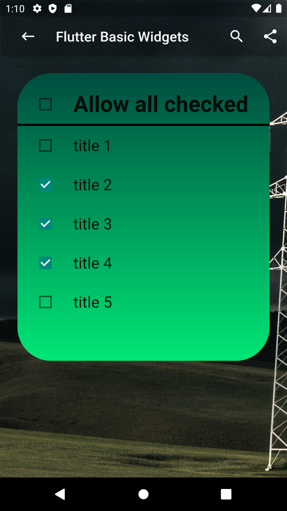

# Basic Widgets Examples

Here you will find a quick way to customise the basic flutter widgets to your taste. 

## Run this project

**EDIT** : No need of running the project, simply run the code in the new official Flutter online compiler [DartPad](https://dartpad.dartlang.org/flutter).

### Still want to run the project?
- Fork this project.
- Rename the directory to "my_basic_widgets" or something with all_lowercase_and_underscore. (Unfortunately, Flutter does not like capital letters.)
- In your terminal, run flutter create . This will create the android and iOS projects for you.
- Run in your emulator or device.

# A. App Background

## 1. Stack 
If you want to overlay children relatively to a parent, use the Stack widget. In this example, Stack is used to order the appBar and the body relatively to a parent image in background.
<table>
    <tr>
        <td>How to overlay children relatively on an image ?</td>
        <td><a href="https://www.youtube.com/watch?v=liEGSeD3Zt8">Learn more about Stack</a></td>
    </tr>
      <tr>
        <td><pre><code>
//**********************Eexemple code****************************//
@override
  Widget build(BuildContext context) {
    return Stack(
      children: [
        Image.network('https://picsum.photos/250?image=9'),
        Scaffold(backgroundColor: Colors.transparent,
          appBar: 
            new MyAppBar( widget.title, 20.0, 
            color: Colors.transparen),
          body:  Container(),         
        ),
      ],
    );
  }
  </code></pre> 
  </td>
        <td></td>
    </tr>
</table>

## 2. BoxDecoration
By considering colour theory, gradients make an application more visually interesting than a conventional design. To apply gradients to a Flutter application, you will use [BoxDecoration](https://api.flutter.dev/flutter/painting/BoxDecoration-class.html) and [LinearGradient](https://api.flutter.dev/flutter/painting/LinearGradient-class.html). the [ShaderMask](https://api.flutter.dev/flutter/widgets/ShaderMask-class.html) class can also be used for the same result
<table style="width:800px">
    <tr>
        <td>How To Use Gradients in Flutter with BoxDecoration ?</td>
        <td><a href="https://www.youtube.com/watch?v=c1xLMaTUWCY">Learn more about Container</a></td>
    </tr>
      <tr>
        <td><pre><code>
//***********************Eexemple code****************************//
Container(
          decoration: BoxDecoration(
            borderRadius: BorderRadius.all(Radius.circular(48.0)),
            gradient: LinearGradient(
              begin: Alignment.topRight,
              end: Alignment.bottomLeft,
              colors: [Colors.green,Colors.grenn[900],],
            )
          ),
          child: Center(
            child: Text(
              'Hello Gradient!',
              style: TextStyle(
                fontSize: 48.0,
                fontWeight: FontWeight.bold,
                color: Colors.white,
              ),
            ),
          ),
        ),
  </code></pre> 
  </td>
        <td></td>
    </tr>
</table>

# B. AppBar
## 2. My custom AppBar class
Try AppBar examples directly from [DartPad](https://dartpad.dartlang.org/flutter).
<table style="width:800px">
    <tr>
        <td>MyAppBar extends AppBar</td>
        <td><a href="https://www.youtube.com/watch?v=mSc7qFzxHDw">Also SilverAppBar</a></td>
    </tr>
      <tr>
        <td><pre><code>
//***********************Eexemple code****************************//
class MyAppBar extends AppBar {
  MyAppBar(String title, double titleSize, {
  colorAppWidgets: colorIcon, 
  double elevation = 4.0, Color color})
      : super(
            title: Row(
              mainAxisAlignment: MainAxisAlignment.start,
              mainAxisSize: MainAxisSize.max,
              children: [
                IconButton(
                  icon: Icon(
                    Icons.keyboard_backspace,
                    color: colorAppWidgets,
                  ),
                  onPressed: () {},
                ),
                Padding(
                  padding: const EdgeInsets.only(left: 16.0),
                  child: Text(title,
                      style: TextStyle(
                          fontSize: titleSize, 
                          color: colorAppWidgets)),
                ),
              ],
            ),
            backgroundColor: color,
            elevation: elevation,
            iconTheme: IconThemeData(color: colorAppWidgets),
            actions: [
              IconButton(
                icon: Icon(Icons.search),
                onPressed: () {},
              ),
              IconButton(
                icon: Icon(Icons.share),
                onPressed: () {},
              ),
            ]);
}
  </code></pre> 
  </td>
        <td></td>
    </tr>
</table>

# C. App Body
## 1. Text
Try out Text widget and it's properties directly from [DartPad](https://dartpad.dartlang.org/flutter)
<table style="width:800px">
    <tr>
        <td>Play with Text properties and styles</td>
        <td><a href="https://www.youtube.com/watch?v=rykDVh-QFfw">Learn more with RichText</a></td>
    </tr>
      <tr>
        <td><pre><code>
//***********************Eexemple code****************************//
class MyCustomText extends Text {
  MyCustomText(String data, {
    double textScaleFactor = 1.2,
    double fontSize = 11.0,
    double letterSpacing = 2.0,
    double wordSpacing = 40.0,
    decoration:  TextDecoration.none,
    fontWeight: FontWeight.normal,
    color: colorText,
    textDecorationStyle: TextDecorationStyle,
    textAlign: TextAlign.center,
  }) :super(
        data,
        textScaleFactor: textScaleFactor,
        textAlign: textAlign,
        style: TextStyle(
            color: color,
            fontSize: fontSize,
            fontWeight: fontWeight,
            letterSpacing: letterSpacing,
            wordSpacing: wordSpacing,
            decoration: decoration,
            decorationStyle: textDecorationStyle
        ),
      );
}
  </code></pre> 
  </td>
        <td></td>
    </tr>
</table>

## 2. My custom TextField
Try out TextField widget and it's properties directly from [DartPad](https://dartpad.dartlang.org/flutter)
<table style="width:800px">
    <tr>
        <td>Play with Text properties and styles</td>
        <td><a href="https://www.youtube.com/watch?v=rykDVh-QFfw">Learn more with RichText</a></td>
    </tr>
      <tr>
        <td><pre><code>
//***********************Eexemple code****************************//
class MyTextInputField extends StatelessWidget {
  final IconData leadingIcon, actionIcon1, actionIcon2;
  final String hint;
  final TextInputType inputType;
  final TextInputAction inputAction;
  final bool obscureText;
  final int maxLines;
  final double containerHeight;
  //
  //
  const MyTextInputField({
    Key key,this.leadingIcon, @required this.hint,
    this.inputType,this.inputAction,this.actionIcon1,
    this.actionIcon2,this.obscureText = false,this.maxLines,
    this.containerHeight,
  }) : super(key: key);
  //
  //
  @override
  Widget build(BuildContext context) {
    Size size = MediaQuery.of(context).size;
    return Padding(
      padding: const EdgeInsets.symmetric(vertical: 10.0),
      child: Container(
            height: size.height * 0.06,width: size.width * 0.8,
            constraints: 
            BoxConstraints.tightFor(height: containerHeight),
            decoration: BoxDecoration(color: colorIcon,
            borderRadius: BorderRadius.circular(20),
            border: Border.all(width: 1.0, color: colorText),),
            child: Row(
                children: [
                    Container(
                        child: Icon(leadingIcon,color: colorText,),
                        padding: 
                        EdgeInsets.symmetric(horizontal: 10.0),),
                    Expanded(
                        child: TextField(keyboardType: inputType,
                        textInputAction: inputAction,
                        maxLines: maxLines,
                        obscureText: obscureText,
                        strutStyle: StrutStyle.disabled,
                        decoration: InputDecoration(
                        hintText: hint ),),),
                    Container(
                        child: Icon(actionIcon1,color: colorText,),
                        padding: 
                        EdgeInsets.symmetric(horizontal: 10.0),),
                    Container(
                        child: Icon(actionIcon2,color: colorText,),
                        padding: EdgeInsets.only(right: 10.0)),
                    ]
                )
            ),
    );
  }
}
  </code></pre></td>
    <td></td>
    </tr>
</table>

## 3. My custom Button
Try out Button widget and it's properties directly from [DartPad](https://dartpad.dartlang.org/flutter)
<table style="width:800px">
    <tr>
        <td>Play with Button properties and styles</td>
        <td><a href="https://www.youtube.com/watch?v=kVEguaQWGAY">Also ToggleButtons</a></td>
    </tr>
    <tr>
        <td><pre><code>
//***********************Eexemple code****************************//
class MyCustomButton extends StatelessWidget {
  final double elevation;
  final double radius;
  final double width;
  final double height;
  final Widget child;
  final BoxDecoration decoration;
  final ShapeBorder shapeBorder;
  final Alignment alignment;
  //
  MyCustomButton({
    Key key,
    this.elevation = 7.5,
    this.radius = 25.0,
    this.width = 300.0,
    this.height = 50.0,
    this.child,
    this.decoration,
    this.shapeBorder,
    this.alignment,
  }) : super(key: key);
  //
  @override
  Widget build(BuildContext context) {
    return Card(
        color: Colors.transparent,
        elevation: elevation,
        shape: shapeBorder,
        child: Container(
            alignment: alignment,
            width: width,
            height: height,
            decoration: decoration,
            child: child));
  }
}
  </code></pre></td>
    <td></td>
    </tr>
    <tr>
            <td><pre><code>
//***********************Eexemple code****************************//
MyCustomButton(
    decoration: BoxDecoration(
        color: Colors.deepPurpleAccent,
        borderRadius: BorderRadius.vertical(
            top: Radius.circular(25.0),
            //bottom: Radius.circular(1.0))
    ),
    child: OutlineButton(
        color: Colors.deepPurpleAccent,
        highlightedBorderColor: Colors.purple,
        splashColor: Colors.green,
        onPressed: (){},
        borderSide: BorderSide(
            width: 5.0,
            color: Colors.deepPurpleAccent),
            child: MyCustomText("My Outline Button",
                fontSize: 15.0,
                color: colorIcon,),
    shape: RoundedRectangleBorder(
        borderRadius: BorderRadius.vertical(
            top: Radius.circular(20.0),
            bottom: Radius.circular(1.0)
        )
    ),
 ),
)
      </code></pre></td>
        <td></td>
        </tr>
</table>

## 3. My custom Image
Try out Image widget and it's properties directly from [DartPad](https://dartpad.dartlang.org/flutter)
<table style="width:800px">
    <tr>
        <td>Play with Image properties and styles</td>
        <td><a href="https://www.youtube.com/watch?v=7oIAs-0G4mw">Learn more about Image</a></td>
    </tr>
    <tr>
        <td><pre><code>
//***********************Example code****************************//
class MyCardWithChild extends Card {
  MyCardWithChild({
    @required Widget child,
    Color color = colorIcon,
    double elevation = 10.0,
    double left = 10.0,
    double right = 10.0,
    double top = 10.0,
    double bottom = 10.0,
    ShapeBorder shapeBorder,
  }): super(
    child: child,
    color: color,
    elevation: elevation,
    margin: EdgeInsets.only(
        left: left,
        right: right,
        top: top,
        bottom: bottom),
    shape: shapeBorder
  );
}
  </code></pre></td>
    <td></td>
    </tr>
</table>

## 4. My custom Snackbar
Try out Snackbar widget and it's properties directly from [DartPad](https://dartpad.dartlang.org/flutter)
<table style="width:800px">
    <tr>
        <td>Play with Snackbar properties and flushbar: ^1.5.0 package </td>
        <td><a href="https://www.youtube.com/watch?v=zpO6n_oZWw0">Learn more about snackbar</a></td>
    </tr>
    <tr>
        <td><pre><code>
//***********************Example code****************************//
 MyContainer(context, [
    MyCustomButton(...),
    MyCustomButton(
        shapeBorder: RoundedRectangleBorder(
            borderRadius: BorderRadius.circular(25.0),),
            child: TextButton(
                onPressed: () => showSimpleFlushbar(context),
                child: MyCustomText(
                    "Show simple flushbar",
                    color: colorIcon,
                    fontSize: 18.0,)
                    ),
            decoration: BoxDecoration(
                color: colorPrimary,
                borderRadius: BorderRadius.circular(25.0)),
                ),
    MyCustomButton(...),
    MyCustomButton(...),
    MyCustomButton(...),
  ]
 )
  </code></pre></td>
    <td></td>
    </tr>
    <tr>
      <td>Show default snackbar</td>
      <td></td>
    </tr>
    <tr>
            <td><pre><code>
//***********************Example code****************************//
void showDefaultSnackbar() {
    Scaffold.of(context).showSnackBar(SnackBar(
      duration: Duration(seconds: 5),
      content: Text(
        "Hello from the default snackbar",
        textScaleFactor: 1.2,
      ),
      action: SnackBarAction(
        label: "Click Me",
        onPressed: () {},
      ),
    ));
  }
</code></pre></td>
        <td></td>
        </tr>
    <tr>
         <td>Show floating snackbar</td>
         <td></td>
       </tr>
    <tr>
   <td><pre><code>
//***********************Example code****************************//
void showFloatingSnackbar(BuildContext context) {
    Flushbar(
      title: "Hello from the floating snackbar",
      message: "This is a custom floating snackbar",
      padding: EdgeInsets.all(10),
      borderRadius: 8,
      backgroundGradient: LinearGradient(
          colors: [colorPrimary, Colors.purple], stops: [0.6, 1]),
      boxShadows: [
        BoxShadow(color: Colors.black45, offset: Offset(3, 3), 
        blurRadius: 3)
      ],
      // The previous flusbars could be dismissed by swiping down
      // now we want to swipe to the sides
      dismissDirection: FlushbarDismissDirection.HORIZONTAL,
      // The default curve is Curves.easeOut
      forwardAnimationCurve: Curves.fastLinearToSlowEaseIn,
    ).show(context);
  }
 </code></pre></td>
            <td></td>
            </tr>
</table>

## 5. My custom AlertDialog
Try out AlertDialog widget and it's properties directly from [DartPad](https://dartpad.dartlang.org/flutter)
<table style="width:800px">
    <tr>
        <td>Play with AlertDialog properties</td>
        <td><a href="https://www.youtube.com/watch?v=75CsnyRXf5I">Learn more about AlertDialog</a></td>
    </tr>
    <tr>
        <td><pre><code>
//***********************Example code****************************//
 class MyAlertDialog extends StatelessWidget {
   ///
   final AlignmentDirectional align;
   double avatarPositionTop;
   final double borderRadius, marginTop, marginBottom;
   final String title;
   final Color backendContainerColor, titleColor;
   final Alignment alignSubmittedWidget;
   final Widget descriptionWidget, avatarChild, submittedWidget;
   ///
   const MyAlertDialog(this.submittedWidget, {
     Key key,@required this.title,
     this.align = AlignmentDirectional.center,
     this.backendContainerColor = Colors.white,
     this.avatarPositionTop = 60,this.descriptionWidget,
     this.avatarChild,this.titleColor,this.alignSubmittedWidget,
     this.marginTop = 25.0,this.marginBottom = 25.0,
     this.borderRadius = 5.0,
   }) : super(key: key);
   ///
   @override
   Widget build(BuildContext context) {
     return Stack(
       alignment: align,
       overflow: Overflow.visible,
       children: <Widget>[
         Card(
           color: backendContainerColor,
           elevation: 7.5,
           margin: EdgeInsets.only(top: 25.0, bottom: 25.0),
           child: Container(
             decoration: BoxDecoration(
                 borderRadius: 
                 BorderRadius.circular(borderRadius)),
             child: Column(
               children: [
                 Container(
                   child: Text(
                     title,
                     style: TextStyle(
                         color: titleColor,
                         fontWeight: FontWeight.bold,
                         letterSpacing: 1.2,
                         fontSize: 24.0),
                   ),
                   margin: EdgeInsets.only(top: marginTop),
                 ),
                 Container(
                   child: descriptionWidget,
                 ),
                 Container(
                   margin: EdgeInsets.only(bottom: marginBottom),
                   child: submittedWidget,
                   alignment: alignSubmittedWidget,
                 ),
               ],
             ),
           ),
         ),
         Positioned(
         top: -avatarPositionTop, child: avatarChild)
       ],
     );
   }
 }

  </code></pre></td>
    <td></td>
    </tr>
    <tr>
      <td>Show custom AlertDialog</td>
      <td></td>
    </tr>
    <tr>
            <td><pre><code>
//***********************Example code****************************//
@override
  Widget build(BuildContext context) {
    double size = MediaQuery.of(context).size.width;
    return new SingleChildScrollView(
        child: new Column(
        mainAxisAlignment: MainAxisAlignment.center,
        children: [
            MyAlertDialog(
            Container(
                alignment: Alignment.center,
                child: MyCustomButton(onPressed: (){},
                backgroundButtonColor: Colors.red.shade300,
                width: 100,
                child: MyCustomText(
                    title: "Okay",
                    textScaleFactor: 1.5,
                    fontWeight: FontWeight.bold,
                    color: Colors.white70,
                    decoration: BoxDecoration(
                        color: Colors.transparent),
                        )
                    )
                ),
                title: "Warning !!!", titleColor: Colors.white70,
                avatarPositionTop: 10,
                marginTop: 80,
                avatarChild: CircleAvatar(
                  backgroundColor: Colors.red.shade300,
                  radius: 50.0,
                  child: Icon(Icons.assistant_photo, size: 50,
                      color: Colors.white70),
                ),
             ),
          ]
        )
     );
  }         
</code></pre></td>
        <td></td>
        </tr>
    <tr>
         <td>Show the custom AlertDialog</td>
         <td></td>
       </tr>
    <tr>
   <td><pre><code>
//***********************Example code****************************//
MyAlertDialog(
    Container(
        alignment: Alignment.centerRight,
        child: MyCustomButton(onPressed: (){},
        backgroundButtonColor: alertDialogColor,
        width: 150,
        child: MyCustomText(
            title: "Confirm",
            textScaleFactor: 1.3,
            fontWeight: FontWeight.bold,
            color: Colors.teal,
            alignment: Alignment.centerRight,
            decoration: BoxDecoration(color: alertDialogColor),
            )
          )
        ),
        title: "Success", titleColor: Colors.white70,
        avatarPositionTop: 8,
        marginTop: 150,
        avatarChild: Container(
         width: 350,
         height: 170,
         child: ClipOval(
            clipBehavior: Clip.hardEdge,
                child: Container(
                color: alertDialogColor,
                    child: Container(
                    color: alertDialogColor,
                    child: Icon(
                        Icons.check_box, 
                        size: 80,
                        color: Colors.teal
                        ),
                      ),
                    ),
                  ),
                ),
         descriptionWidget: Container(
            height: 200,
            child: MyCustomText(
            title: "You can not . . . "
            alignment: Alignment.center,
            color: Colors.white70,
            textScaleFactor: 1.2,
         ),
        ),
        backendContainerColor: alertDialogColor,
        alignSubmittedWidget: Alignment.center,
    ),
 </code></pre></td>
            <td></td>
            </tr>
</table>

## 6. My custom CheckBox
Try out CheckBox widget and it's properties directly from [DartPad](https://dartpad.dartlang.org/flutter)
<table style="width:800px">
    <tr>
        <td>Play with CheckBox properties</td>
        <td><a href="https://www.youtube.com/watch?v=RkSqPAn9szs">Learn more CheckboxListTile</a></td>
    </tr>
    <tr>
        <td><pre><code>
//***********************Example code****************************//
//***********************CkeckBoxModel class ********************//
 class CkeckBoxModel {
   String title;
   bool value;
   CkeckBoxModel({@required this.title, this.value = false});
 }
//
//****Init the CkeckBoxModel outside of `Build`****************//
  final allchecked = CkeckBoxModel(title: "Allow all checked");
    final checkboxList = [
      CkeckBoxModel(title: "title 1", value: false),
      CkeckBoxModel(title: "title 2", value: false),
      CkeckBoxModel(title: "title 3", value: false),
      CkeckBoxModel(title: "title 4", value: false),
      CkeckBoxModel(title: "title 5", value: false),
    ];
//**************************** `Build`************************//
ListView(
    children: [
       Divider(),
       ListTile(
            title: Text(allchecked.title, textScaleFactor: 2.0,
            style: TextStyle(fontWeight: FontWeight.bold),),
            onTap: () => onAllClicked(allchecked),
            leading: Checkbox(
            value: allchecked.value,
             onChanged: (value) => onAllClicked(allchecked),
                ),
            ),
        Container(height: 3, color: Colors.black,),
        ...checkboxList.map((item) =>
        ListTile(
            title: Text(item.title, textScaleFactor: 1.4,),
             onTap: () => onItemClicked(item),
             leading: Checkbox(
             value: item.value,
             onChanged: (value) => onItemClicked(item),
              ),
             ),
        ).toList()
    ],
)
//************************Methoden**************************//
onItemClicked(CkeckBoxModel item){
    final newValue = !item.value;
    setState(() {
      item.value = newValue;
      if(!newValue){
        allchecked.value = false;
      }else{
        final allListChecked = checkboxList.every((
        element) => element.value);
        allchecked.value = allListChecked;
      }
    });
  }
  //
   onAllClicked(CkeckBoxModel item){
      final newValue = !item.value;
      setState(() {
        item.value = newValue;
        checkboxList.forEach((element) {
          element.value = newValue;
        });
      });
    }
</code></pre></td>
    <td></td>
   </tr>
</table>

### Learn more on Flutter    
[Official Flutter documentation](https://flutter.dev/docs)  
[Flutter widget list](https://flutter.dev/docs/development/ui/widgets)  
[Flutter youtube channel](https://www.youtube.com/channel/UCwXdFgeE9KYzlDdR7TG9cMw)

### Created & maintained by   
Idriss Tchio ([LinkedIn](https://www.linkedin.com/in/idriss-tchio/))

### Contribution Guidelines    
This project is a fully open source project, and contributions are welcome.

### Support
This project helped you? Buy me a coffee to support me! [PayPal](https://paypal.me/drogbut "PayPal")

### Licence
*Copyright 2021 Idriss Tchio*
